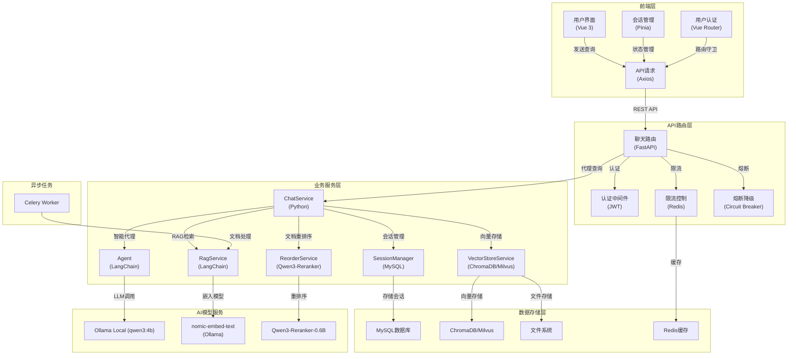

# 🚀 LangChain-RAG-FastAPI-Service (v2.1.0)

## 📋 目录

- [项目简介](#项目简介)
- [核心特性](#核心特性)
- [三种运行模式](#三种运行模式)
- [技术架构](#技术架构)
- [快速开始](#快速开始)
- [项目结构](#项目结构)
- [API 文档](#api-文档)
- [配置说明](#配置说明)
- [知识库管理](#知识库管理)
- [RAG检索性能测试](#rag检索性能测试)
- [部署指南](#部署指南)
- [开发指南](#开发指南)
- [故障排除](#故障排除)
- [联系方式](#联系方式)

## 项目简介

这是一个基于 **FastAPI + LangChain** 构建的企业级 **RAG（检索增强生成）** 智能对话系统，支持本地大模型推理和多种向量数据库。系统采用微服务架构，具备会话持久化、限流熔断、JWT认证和模块化设计等特性，实现全链路离线闭环。

知识库文档由管理员在后端统一管理，用户前端仅提供问答功能。

## 核心特性

- **智能问答** 💬：基于 RAG 技术，结合文档检索和大语言模型，提供精准的问答体验
- **会话持久化** 💾：使用 MySQL 存储会话历史，支持长期保存和回溯
- **多语言支持** 🌐：前端集成 i18n，支持中英文界面切换
- **微服务架构** 🏗️：完整的用户认证、限流熔断、全局日志
- **三种运行模式** 🎮：向量模式、LLM模式、完整模式，按需启动
- **高性能** ⚡：基于 FastAPI、ChromaDB/Milvus
- **本地推理** 🖥️：支持 Ollama 部署本地开源大模型，摆脱在线 API 依赖
- **两阶段检索** 🔍：向量粗筛 + Cross-Encoder 重排序，提升检索准确率

## 三种运行模式

| 模式 | 描述 | 所需服务 | 适用场景 |
|------|------|----------|----------|
| **模式1** | 向量模式 | FastAPI + ChromaDB + MySQL | 仅需文档检索，不需要LLM推理 |
| **模式2** | LLM模式 | FastAPI + MySQL | 需要AI对话，不需要文档上传 |
| **模式3** | 完整模式 | FastAPI + ChromaDB + Redis + Celery + MySQL + Ollama | 完整功能，包含文档上传、向量化、RAG检索、LLM推理 |

## 技术架构



## 快速开始

### 环境要求

#### 后端环境
- Python 3.11+
- MySQL 8.0+
- Redis (可选，用于限流熔断)
- Ollama (本地模型运行)

#### 前端环境
- Node.js 16+
- npm 或 pnpm

### 克隆项目

```bash
git clone https://github.com/huasheng6543/LangChain-RAG-FastAPI-Service-master.git
cd LangChain-RAG-FastAPI-Service-master
```

### 安装依赖

#### 后端依赖
```bash
cd backend

# 使用虚拟环境 (Windows)
venv\Scripts\activate

# 安装依赖
pip install -r requirements.txt
```

#### 前端依赖
```bash
cd front

# 安装依赖
npm install
```

### 环境配置

在 `backend` 目录下创建 `.env` 文件：

```env
# 运行模式: 1=向量模式, 2=LLM模式, 3=完整模式
RUN_MODE=2

# 数据库配置
DB_HOST=localhost
DB_PORT=3306
DB_USER=root
DB_PASSWORD=your_password
DB_NAME=chatbot

# Redis配置 (模式3)
REDIS_HOST=localhost
REDIS_PORT=6379
REDIS_PASSWORD=

# 安全配置
SECRET_KEY=your_secret_key
ALGORITHM=HS256
ACCESS_TOKEN_EXPIRE_MINUTES=30

# Ollama配置
DEEPSEEK_BASE_URL=http://localhost:11434
CHAT_MODEL_TYPE=ollama
OLLAMA_CHAT_MODEL=qwen3:4b

# Reranker模型配置
RERANKER_MODEL_PATH=models/Qwen3-Reranker-0.6B

# LangSmith配置 (可选)
LANGCHAIN_TRACING_V2=true
LANGCHAIN_API_KEY=your_langsmith_api_key
LANGCHAIN_PROJECT=my-fastapi-langchain-project
```

### 启动服务

#### 一键启动（推荐）

```bash
# Windows
start.bat 1  # 模式1：向量模式
start.bat 2  # 模式2：LLM模式
start.bat 3  # 模式3：完整模式

# Linux/Mac
bash start.sh 1
bash start.sh 2
bash start.sh 3
```

#### 手动启动

```bash
# 启动后端服务
cd backend
venv\Scripts\activate
python -m uvicorn main:app --host 0.0.0.0 --port 8000
```

#### 启动前端服务
```bash
cd front
npm run dev
```

前端将在 `http://localhost:3000` 运行。

#### 启动依赖服务

```bash
# MySQL
net start mysql

# Redis
net start redis

# Ollama (本地模型)
ollama serve

# 下载Ollama模型
ollama pull qwen3:4b
ollama pull nomic-embed-text
```

### 下载模型（模式3）

```bash
cd backend
venv\Scripts\activate
python download_models.py
```

下载完成后，模型将保存在 `backend/models/` 目录。

## 技术栈

### 后端技术
| 技术 | 用途 |
|------|------|
| **FastAPI** ⚡ | 高性能异步 Web 框架 |
| **LangChain** 🦜 | 大语言模型应用开发框架 |
| **SQLAlchemy** 🗄️ | ORM 数据库操作 |
| **ChromaDB** 📚 | 轻量级向量数据库 |
| **Milvus** 🚀 | 分布式向量数据库（可选） |
| **MySQL** 🗄️ | 关系型数据库 |
| **Redis** ⚡ | 缓存和限流 |
| **Celery** 🧵 | 异步任务处理 |
| **JWT** 🔑 | 用户认证 |
| **Ollama** 🐑 | 本地模型运行 |

### 前端技术
| 技术 | 用途 |
|------|------|
| **Vue 3** 🖼️ | 现代化前端框架 |
| **Vite** ⚡ | 极速构建工具 |
| **Vue Router** 🛣️ | 路由管理 |
| **Pinia** 📦 | 状态管理 |
| **Vant** 🎨 | 移动端 UI 组件库 |
| **i18n** 🌍 | 国际化支持 |

## 项目结构

```
├── backend/                  # FastAPI 后端服务
│   ├── app/                  # 应用代码
│   │   ├── agent/            # 智能代理模块
│   │   ├── cache/            # 缓存模块
│   │   ├── config/           # 配置文件目录
│   │   ├── core/             # 核心组件 (限流、熔断、权限)
│   │   ├── db/               # 数据库配置
│   │   ├── llm/              # LLM 适配器
│   │   ├── models/           # 数据模型定义
│   │   ├── prompt/           # 提示词模板
│   │   ├── rag/              # RAG 核心功能
│   │   ├── router/           # API 路由定义
│   │   ├── schemas/          # 数据结构定义
│   │   ├── services/         # 服务层
│   │   ├── tasks/            # Celery 异步任务
│   │   └── utils/            # 工具函数
│   ├── models/               # 本地模型目录
│   ├── .env                  # 环境变量配置
│   ├── .env.example          # 环境变量示例
│   ├── main.py               # 应用入口文件
│   ├── start_server.py       # 启动脚本
│   ├── requirements.txt      # 后端依赖列表
│   ├── download_models.py    # 模型下载脚本
│   ├── upload_knowledge.py   # 知识库文档上传脚本
│   └── verify_env.py         # 环境验证脚本
├── front/                    # Vue 前端项目
│   ├── src/
│   │   ├── views/            # 页面组件
│   │   ├── components/       # 可复用组件
│   │   ├── store/            # Pinia 状态管理
│   │   ├── router/           # 路由配置
│   │   ├── config/           # API 配置
│   │   ├── i18n/             # 国际化配置
│   │   └── utils/            # 工具函数
│   ├── public/               # 静态资源
│   ├── package.json          # 前端依赖配置
│   └── vite.config.js        # Vite 配置
├── docs/                     # 文档目录
├── images/                   # 项目截图
├── docker-compose.yml        # Docker 部署配置
├── start.bat                 # Windows 一键启动脚本
├── start.sh                  # Linux/Mac 一键启动脚本
├── stop.bat                  # Windows 停止脚本
├── stop.sh                   # Linux/Mac 停止脚本
└── README.md                 # 项目说明文档
```

## API 文档

### FastAPI 后端 API
- **交互式文档**: http://localhost:8000/docs
- **Redoc 文档**: http://localhost:8000/redoc

### 核心接口

| 接口 | 方法 | 描述 |
|------|------|------|
| `/user/login/` | POST | 用户登录 |
| `/user/register/` | POST | 用户注册 |
| `/user/detail/` | GET | 获取用户信息 |
| `/api/agent/query` | POST | AI对话查询 |
| `/api/agent/query/stream` | POST | 流式AI对话 |
| `/api/rag/query` | POST | RAG问答查询 |
| `/api/vector/add/single` | POST | 上传单个文件（管理员） |
| `/api/vector/add/multiple` | POST | 上传多个文件（管理员） |
| `/api/vector/clean` | DELETE | 清空向量数据库 |
| `/api/session/` | GET/DELETE | 会话管理 |
| `/health/live` | GET | 健康检查 |

## 配置说明

### 运行模式配置

在 `backend/.env` 文件中配置运行模式：

```env
# 运行模式: 1=向量模式, 2=LLM模式, 3=完整模式
RUN_MODE=2
```

### 向量数据库配置

在 `backend/app/config/rag.yaml` 中配置：

```yaml
# 聊天模型配置
chat_model_name: qwen3-max

# 文本嵌入模型配置
text_embedding_model_name: text-embedding-v4

# 向量数据库配置
vector_db: chromadb

# 文档切分配置
chunk_size: 200
chunk_overlap: 20
```

### Ollama模型配置

在 `backend/.env` 文件中配置：

```env
CHAT_MODEL_TYPE=ollama
OLLAMA_CHAT_MODEL=qwen3:4b
DEEPSEEK_BASE_URL=http://localhost:11434
```

## 知识库管理

### 上传文档

知识库文档由管理员通过后端脚本上传：

```bash
cd backend
venv\Scripts\activate

# 上传单个文件
python upload_knowledge.py ./docs/pet_guide.pdf

# 上传整个目录
python upload_knowledge.py ./docs/
```

**支持的文件格式：**
- `.txt` - 纯文本文件
- `.pdf` - PDF文档
- `.md` - Markdown文件
- `.docx` - Word文档
- `.pptx` - PowerPoint文档

### 管理文档

```bash
# 通过API清空向量数据库
curl -X DELETE "http://localhost:8000/api/vector/clean" \
  -H "Authorization: Bearer your-jwt-token"
```

## RAG检索性能测试

### 测试结果

| 测试项目 | 结果 |
|----------|------|
| **单向量检索召回率** | 100% (20/20) |
| **Cross-Encoder重排序后召回率** | 100% (20/20) |
| **复杂文档误召回率降低** | ~75% |
| **重排序耗时** | 14-35秒/次 (CPU) |

### 测试脚本

```bash
cd backend
venv\Scripts\activate

# 运行完整测试
python test_rag_performance.py

# 运行检索性能测试
python test_retrieval_performance.py
```

## 部署指南

### 使用 Docker Compose（推荐）

项目提供完整的 Docker Compose 容器编排方案，一键启动 FastAPI、MySQL、Redis、Milvus、Celery 整套服务。

#### 一键启动脚本

```bash
# Windows
docker-start.bat start

# Linux/Mac
chmod +x docker-start.sh
./docker-start.sh start
```

#### 管理命令

```bash
# 启动服务
docker-start.bat start          # Windows
./docker-start.sh start          # Linux/Mac

# 停止服务
docker-start.bat stop           # Windows
./docker-start.sh stop           # Linux/Mac

# 重启服务
docker-start.bat restart        # Windows
./docker-start.sh restart        # Linux/Mac

# 查看服务状态
docker-start.bat status         # Windows
./docker-start.sh status         # Linux/Mac

# 查看日志
docker-start.bat logs           # 查看所有日志
docker-start.bat logs fastapi   # 查看FastAPI日志
docker-start.bat logs celery    # 查看Celery日志

# 构建镜像
docker-start.bat build          # Windows
./docker-start.sh build          # Linux/Mac

# 清理所有容器和数据
docker-start.bat clean          # Windows (需确认)
./docker-start.sh clean          # Linux/Mac (需确认)
```

#### Docker Compose 服务清单

| 服务 | 镜像 | 端口 | 说明 |
|------|------|------|------|
| **fastapi** | 自定义构建 | 8000 | 主应用服务 |
| **mysql** | mysql:8.0 | 3306 | 会话数据库 |
| **redis** | redis:7-alpine | 6379 | 缓存/限流/消息队列 |
| **milvus** | milvusdb/milvus:v2.4.5 | 19530 | 向量数据库 |
| **celery** | 自定义构建 | - | 异步任务处理 |
| **celery-beat** | 自定义构建 | - | 定时任务调度 |

#### 日志持久化方案

- **容器日志**: 使用 json-file 驱动，自动轮转
  - FastAPI/Celery: 单文件最大50MB，保留10个文件
  - MySQL/Redis: 单文件最大10MB，保留5个文件
  - Milvus: 单文件最大50MB，保留5个文件
- **应用日志**: 挂载到 `backend/logs/` 目录
- **数据持久化**: 使用 Docker volumes 挂载 MySQL、Redis、Milvus 数据

#### 手动启动

```bash
# 启动全部服务（后台运行）
docker-compose up -d

# 查看服务状态
docker-compose ps

# 查看日志
docker-compose logs -f
docker-compose logs -f fastapi
docker-compose logs -f celery

# 停止服务
docker-compose stop

# 停止并删除容器
docker-compose down

# 停止并删除容器和数据卷
docker-compose down -v
```

### 生产环境部署

1. **安装依赖**: 参考快速开始
2. **配置环境变量**: 创建 `.env` 文件
3. **启动服务**: 使用 `docker-start.bat start` 或 `./docker-start.sh start`
4. **配置反向代理**: 使用 Nginx 或 Caddy
5. **配置 SSL**: 配置 HTTPS 证书

### 部署架构

```
┌─────────────────────────────────────────────────────────┐
│                    Nginx / Caddy                        │
│              (反向代理 + SSL + 负载均衡)                  │
└──────────────────────┬──────────────────────────────────┘
                       │
┌──────────────────────▼──────────────────────────────────┐
│                 Docker Compose                          │
│  ┌──────────┐ ┌──────────┐ ┌──────────┐ ┌──────────┐    │
│  │  FastAPI │ │   MySQL  │ │  Redis   │ │  Milvus  │    │
│  │  :8000   │ │   :3306  │ │   :6379  │ │ :19530   │    │
│  └────┬─────┘ └──────────┘ └────┬─────┘ └──────────┘    │
│       │                         │                       │
│       │                         │                       │
│  ┌────▼─────┐           ┌───────▼───────┐              │
│  │  Celery  │           │ Celery Beat   │              │
│  │  Worker  │           │ (定时任务)    │              │
│  └──────────┘           └───────────────┘              │
└─────────────────────────────────────────────────────────┘
```

## 开发指南

### 代码结构说明
- **backend/app/rag/**：RAG 核心功能，包括向量存储和检索
- **backend/app/agent/**：智能代理，处理用户请求和对话逻辑
- **backend/app/core/**：核心组件，限流、熔断、权限控制
- **backend/app/llm/**：LLM 适配器，支持多种模型
- **backend/app/router/**：API 路由定义
- **front/src/views/**：前端页面组件
- **front/src/components/**：可复用的前端组件

### 开发流程
1. **添加新功能**
   - 在对应的模块中添加代码
   - 运行测试确保功能正常
   - 更新相关文档
2. **调试技巧**
   - 使用 FastAPI 的自动重载功能：`uvicorn main:app --reload`
   - 使用 Vue 的热更新功能：`npm run dev`

## 故障排除

### 常见问题

1. **服务启动失败**
   - 检查端口是否被占用
   - 检查 MySQL/Redis 服务是否启动
   - 检查 `.env` 文件配置是否正确

2. **前端连接后端失败**
   - 检查后端服务是否在运行
   - 检查 Vite 代理配置 (`vite.config.js`)
   - 检查浏览器控制台错误信息

3. **模型加载失败**
   - 检查模型文件是否下载完成
   - 检查模型路径配置是否正确
   - 检查 Ollama 是否正确安装和启动

4. **401 认证错误**
   - 检查 JWT Token 是否过期
   - 检查登录状态是否正常
   - 重新登录获取新 Token

5. **向量检索失败**
   - 检查向量数据库是否正常运行
   - 检查文档是否已正确上传
   - 检查嵌入模型配置

## 联系方式

如有任何问题或建议，请随时联系我们。😊

---

⭐ 如果这个项目对您有帮助，请给我们一个 Star！
